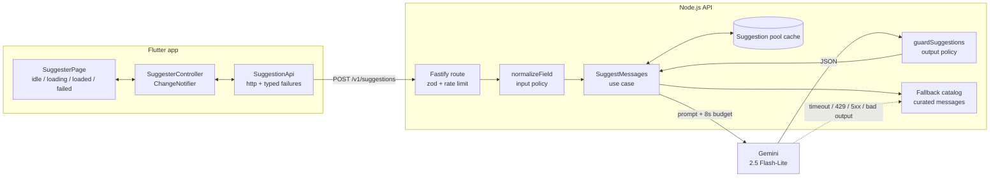

# AI Gift Card Message Suggester

Solution for the [Smash technical test](docs/CHALLENGE.md): a Node.js/TypeScript API that asks a
language model for two or three short gift card messages, and a Flutter app that consumes it.

The property the whole design is built around: **a valid request always returns usable messages.**
Every way the model can fail — no API key, timeout, 429, 5xx, malformed output, output that broke
the content rules, daily budget spent — degrades into a curated catalog and is reported in the
payload, never as an HTTP error.

```
backend/       Node.js 20 + TypeScript + Fastify + Zod. Vitest.
flutter_app/   Flutter 3.38 + Dart 3.10. Material 3, http, flutter_test.
docs/          The original brief, the security notes, and how AI was used to build this.
```

---

## Table of contents

- [Running it](#running-it)
- [Architecture](#architecture)
- [API contract](#api-contract)
- [Failure policy: what degrades and what does not](#failure-policy-what-degrades-and-what-does-not)
- [Security: the inputs are untrusted](#security-the-inputs-are-untrusted)
- [Rate limiting](#rate-limiting)
- [Cost and caching](#cost-and-caching)
- [Tests](#tests)
- [Decisions and trade-offs](#decisions-and-trade-offs)
- [What I would do next](#what-i-would-do-next)
- [How I used AI](#how-i-used-ai)

---

## Running it

### Requirements

| Tool | Version | Note |
| --- | --- | --- |
| Node.js | 20+ | tested on 20.19.5 |
| Flutter | 3.38+ | pinned in `flutter_app/.fvmrc`, tested on 3.38.10 / Dart 3.10.9 |
| Gemini API key | optional | free tier at [aistudio.google.com/apikey](https://aistudio.google.com/apikey) |

### Backend

```bash
cd backend
cp .env.example .env     # optional: fill in GEMINI_API_KEY
npm install
npm run dev              # http://localhost:3000
```

**It runs with no API key.** In that mode `/health` reports `"llm": "not_configured"` and every
request answers from the fallback catalog with `degradedReason: "not_configured"`. The whole flow,
including the Flutter app, works end to end without any credential — which is also how the degraded
path is demonstrated without having to break anything.

The API loads `.env` itself at start-up (`process.loadEnvFile`, no dependency); real environment
variables take precedence over the file. With a key in place `/health` answers `"llm": "configured"`.

`GEMINI_MODEL` defaults to `gemini-2.5-flash-lite`. Google retires model ids on a schedule — the
2.0 Flash ids stopped serving in June 2026 — so if every response degrades with `upstream_error` on
a fresh key, check which ids the key can see and set one of them:

```bash
curl -s -H "x-goog-api-key: $GEMINI_API_KEY" \
  https://generativelanguage.googleapis.com/v1beta/models | grep '"name"'
```

Check it:

```bash
curl -s localhost:3000/health

curl -s -X POST localhost:3000/v1/suggestions \
  -H 'content-type: application/json' \
  -d '{"occasion":"Birthday","relationship":"Friend"}'
```

### Flutter app

```bash
cd flutter_app
flutter pub get          # or: fvm flutter pub get
flutter run              # add -d chrome to run it in the browser
```

The base URL is configurable and defaults sensibly per platform:

| Target | Default | Override |
| --- | --- | --- |
| iOS simulator, web | `http://localhost:3000` | — |
| Android emulator | `http://10.0.2.2:3000` | — |
| Physical device | — | `--dart-define=API_BASE_URL=http://<your-lan-ip>:3000` |

```bash
flutter run --dart-define=API_BASE_URL=http://192.168.0.10:3000
```

The Android emulator cannot reach the host through `localhost`, so the app resolves `10.0.2.2`
itself instead of leaving that as a trap for whoever runs it
([`core/app_config.dart`](flutter_app/lib/core/app_config.dart)). Two platform details that
otherwise turn a working backend into "could not reach the server": Android refuses plain HTTP by
default, so the **debug** manifest sets `usesCleartextTraffic` (release builds keep the platform
default), and iOS gets `NSAllowsLocalNetworking` so a physical device can reach a LAN address.

---

## Architecture



The dependency rule is one-directional: `http → application → domain`, with `infra` implementing the
domain ports. The use case only ever sees the `LlmProvider` interface, which is exactly what makes
the fallback path testable without a network or an API key.

```
backend/src/
  domain/        suggestion.ts, errors.ts, ports.ts     — types and interfaces, no dependencies
  application/   suggest-messages.ts                    — the degrade-instead-of-fail rule
                 normalize-input.ts                     — input policy
                 output-guard.ts                        — output policy
                 cache-key.ts
  infra/         gemini-provider.ts, prompt.ts          — the only place that knows about Gemini
                 fallback-catalog.ts, suggestion-pool-cache.ts,
                 daily-call-budget.ts, logger.ts, config.ts
  http/          server.ts, rate-limiter.ts, openapi.ts
  main.ts        composition root — the only file that wires concrete classes together
```

```
flutter_app/lib/
  core/    app_config.dart                    — base URL resolution
  data/    suggestion_api.dart                — HTTP, maps status codes to typed failures
           suggestion_failure.dart            — sealed failures, each with a human message
           models/                            — Suggestion, SuggestionResult
  state/   suggester_controller.dart          — ChangeNotifier, guards double taps and late responses
           suggester_state.dart               — sealed: Idle | Loading | Loaded | Failed
  ui/      suggester_page.dart, widgets/      — presentation only
```

State management is a `ChangeNotifier` plus a sealed state class, with no state library. For one
screen with four states that is the whole job, an exhaustive `switch` over a sealed class gives the
compiler the power a library would give at runtime, and it keeps the dependency list at exactly one
package (`http`).

---

## API contract

### `POST /v1/suggestions`

```jsonc
{
  "occasion": "Birthday",       // required, 2-40 chars, free text
  "relationship": "Friend",     // required, 2-40 chars, free text
  "locale": "en",               // optional: "en" | "pt-BR", default "en"
  "count": 3,                   // optional: 2 or 3, default 3
  "refresh": false              // optional: skip the cache and ask the model again
}
```

`200 OK`

```jsonc
{
  "requestId": "req_9dtw7x8emubre38i",
  "source": "llm",              // "llm" | "cache" | "fallback"
  "suggestions": [
    { "id": "s1", "text": "Happy birthday! Wishing you a year as good as you are." },
    { "id": "s2", "text": "Hope your day is full of the people and things you love." },
    { "id": "s3", "text": "Another year, and you keep getting better. Enjoy it!" }
  ],
  "meta": {
    "occasion": "birthday",     // normalised — what the model and the cache key actually saw
    "relationship": "friend",
    "locale": "en",
    "model": "gemini-2.5-flash-lite",
    "promptVersion": "v1",
    "latencyMs": 812
  }
}
```

A degraded answer is still `200`, with the reason attached:

```jsonc
{
  "requestId": "req_usofyacbmubre37j",
  "source": "fallback",
  "degradedReason": "timeout",
  "suggestions": [ /* curated messages */ ],
  "meta": { "model": null, "promptVersion": null, "latencyMs": 8004 }
}
```

Errors are the same shape everywhere and never carry anything from upstream:

```jsonc
{
  "error": { "code": "invalid_request", "message": "...", "details": ["occasion: length out of range"] },
  "requestId": "req_m0lk1wcamubre384"
}
```

| Endpoint | Purpose |
| --- | --- |
| `POST /v1/suggestions` | the feature |
| `GET /health` | liveness, plus whether a model key is configured |
| `GET /openapi.json` | the contract above, machine-readable |

### Why `200` with `source` instead of an error status

The three candidate designs were: return `5xx` when the model fails; return `200` with fallback
messages and no marker; or return `200` with the fallback plus a machine-readable reason.

The first is wrong because from the caller's point of view nothing failed — it asked for gift card
messages and it is getting gift card messages. A `5xx` would also make every client, monitor and
retry policy treat a working product as an outage.

The second is worse than it looks: the client cannot tell a generated message from a canned one, so
it cannot be honest with the user, and the quality regression is invisible in metrics.

So: `200`, `source` says where the text came from, `degradedReason` says why the model was not used.
The app renders a quiet notice rather than an error screen, and the reason is the dimension you
aggregate on in a dashboard — `not_configured` in production means a broken deploy, while a spike of
`timeout` means the provider is struggling.

---

## Failure policy: what degrades and what does not

| Situation | Result |
| --- | --- |
| No `GEMINI_API_KEY` | `200` fallback, `not_configured` — the model is never called |
| Model exceeded the 8s budget | `200` fallback, `timeout` |
| Model returned 429 after the retry | `200` fallback, `rate_limited` |
| Model returned 5xx, or the socket failed | `200` fallback, `upstream_error` (retried once) |
| Model returned another 4xx, such as a bad key or a retired model id | `200` fallback, `upstream_error` (not retried: it will not change) |
| Model returned non-JSON, too few items, or items too long | `200` fallback, `invalid_output` |
| Model echoed the canary or returned a link or markup | `200` fallback, `unsafe_output` |
| Daily call budget spent | `200` fallback, `budget_exhausted` — the model is never called |
| `occasion` or `relationship` missing, too short, too long, wrong type | `400 invalid_request` |
| Input rejected by the input policy | `400 invalid_request` |
| Body is not JSON, or over 8 KB | `415 unsupported_media_type`, `413 payload_too_large` |
| Caller over the rate limit | `429 rate_limited` with `Retry-After` |
| Anything unhandled | `500 internal_error` with only a request id |

The dividing line is who can fix it. A caller that sent a bad request gets a `4xx` telling it what
to change. A caller that sent a good request is never punished for a problem on our side of the
wire — it gets messages.

The 8-second budget covers the whole attempt including the single retry, enforced with one
`AbortController` created in the use case and passed down; the backoff wait aborts with it, so a
retry can never push the response past the budget.

The fallback catalog is indexed by occasion and locale only. `relationship` does not pick a curated
message, on purpose: it keeps the catalog small enough to review by hand and every message in it
safe for any recipient, which is the property that matters when the model is down.

---

## Security: the inputs are untrusted

`occasion` and `relationship` are free text that goes into a prompt, which makes prompt injection
the main risk in this feature. The full notes are in [docs/SECURITY.md](docs/SECURITY.md); the
controls, in the order a request meets them:

1. **Input policy** ([`normalize-input.ts`](backend/src/application/normalize-input.ts)) — Unicode
   normalisation, control characters stripped, 40 character ceiling, and a rejection list for text
   that is talking to the model rather than naming an occasion (`ignore previous instructions`,
   `you are now`, `act as`, markup, URLs, `${`). Rejections are `400`, not silent edits.
2. **Structural isolation** ([`prompt.ts`](backend/src/infra/prompt.ts)) — user values never join
   the instruction text. They travel as JSON inside a `<request>` element that the system prompt
   declares to be untrusted data, with an explicit instruction never to follow, quote or answer
   anything found inside it.
3. **Canary** — a random token is placed in the system prompt each call. If it comes back in the
   output, the model is repeating its instructions and the response is discarded as `unsafe_output`.
4. **Output policy** ([`output-guard.ts`](backend/src/application/output-guard.ts)) — the response
   is JSON-schema constrained at the provider, then validated again here: exact count, 8 to 220
   characters, at most two sentences, no duplicates, no URLs, no markup, no code fences, no prompt
   vocabulary. Anything else degrades to the fallback.
5. **The key never leaves the server.** That is the reason this feature has a backend at all. The
   Flutter app has no credential and can reach no model.
6. **Nothing from upstream reaches the client.** The provider's error body is read only to decide
   whether to retry, and is then dropped. Logs are structured and carry a request id, a reason and a
   latency — never the prompt, the inputs, or the key.

The input rejection list is defence in depth and is stated as such in the code. It is a filter, and
filters can be worked around; the controls that hold are the structural ones — data separated from
instructions, a schema-constrained response, and a validator that refuses anything that does not
look like a gift card message.

Not covered here, and called out rather than left implicit: there is no authentication, so the
endpoint is open to anyone who can reach it. For anything public this needs Firebase App Check or
an anonymous-auth token before the rate limiter, which is the shape of abuse that actually costs
money.

---

## Rate limiting

Implemented, and on by default: a fixed window per client IP, 30 requests per minute, configurable
with `RATE_LIMIT_MAX` and `RATE_LIMIT_WINDOW_MS`. The client is the socket address;
`X-Forwarded-For` is ignored unless `TRUST_PROXY=true`, because a header the caller writes is not
an identity and honouring it would put the whole limit one header away from a bypass. Over the limit the answer is `429` with
`Retry-After` and a `rate_limited` code; `X-RateLimit-Remaining` is on every response. The app turns
that into "Too many requests. Please wait a moment and try again." with a retry button, rather than
a generic error.

It is in memory, which is right for one instance and wrong for more than one: two instances mean two
windows and twice the effective limit. In production this belongs in Redis, or at the edge (API
Gateway, Cloud Armor), keyed by authenticated identity rather than IP, since IP is both shared by
whole offices and trivially rotated.

A second limiter sits behind it for a different threat: `DAILY_LLM_CALL_BUDGET` caps paid calls per
process per day. Past the cap the API keeps working from the catalog instead of running up a bill —
rate limiting protects the service, the budget protects the invoice.

---

## Cost and caching

**Implemented**, because this feature is unusually well suited to it: the input space is
`occasion × relationship × locale`, and almost all real traffic lands on a handful of pairs
(birthday/friend, birthday/mother, wedding/friend). Cardinality is low, so hit rate is high, so
caching is not a micro-optimisation here — it is most of the cost model.

The naive version has a product problem: cache one response per key and every customer buying a
birthday card for a friend sees the same three sentences. So the cache stores a **pool** per key
(up to 12 messages, TTL one hour) that grows as the model is called again, and reads sample from it.
Callers get variety, and the cost of that variety is bounded
([`suggestion-pool-cache.ts`](backend/src/infra/suggestion-pool-cache.ts)). `refresh: true` skips
the read, generates, and merges into the pool — that is what the app's "New suggestions" button
sends.

The key is `sha256(promptVersion, model, locale, occasion, relationship)`, so changing the prompt or
the model invalidates everything rather than blending outputs from two different prompts.

Other levers, roughly in order of what they are worth:

| Lever | Effect |
| --- | --- |
| Pool cache on a low-cardinality key | the largest single reduction; a warm pool costs nothing |
| Precompute the top ~50 pairs offline, nightly | the common path never touches the model at request time |
| Small model (Gemini 2.5 Flash-Lite) + `maxOutputTokens: 400` | roughly 350 in / 150 out per call, so the cost ceiling per call is fixed |
| JSON schema response | no reprompt-on-parse-failure, which is a hidden multiplier |
| Single bounded retry | stops a provider incident from multiplying spend |
| Daily call budget | a hard ceiling, independent of every heuristic above |

In production the in-process map becomes Redis with the same pool semantics, and the precompute job
writes into the same key space so a cold instance starts warm. The numbers to watch are cache hit
rate, `degradedReason` counts by type, and cost per thousand requests rather than per call.

---

## Tests

56 tests, all passing, no network and no API key required.

```bash
cd backend && npm test          # 42 tests
cd flutter_app && flutter test  # 14 tests
```

**Backend (Vitest).** `tests/fallback.test.ts` is the one the brief asks for and covers the path in
every direction: timeout, rate limit, unexpected exception, missing key, spent budget, localised
fallback, and the success case as a control. It also asserts what does *not* happen — that the model
is never called when there is no key or no budget. `tests/suggestions-route.test.ts` drives the real
Fastify instance with `app.inject`, including the birthday-and-friend flow the brief names, the
`200`-with-`degradedReason` contract, `400` for an injection attempt, `429` past the limit, and an
assertion that an upstream error message containing a credential never appears in the response body.
`gemini-provider.test.ts` drives the real adapter against a stubbed `fetch`: which statuses are
retried and which are not, the abort budget, the canary, and that the key travels only as a header.
`output-guard.test.ts` and `normalize-input.test.ts` cover the two security policies directly.

**Flutter.** `suggester_controller_test.dart` covers every state transition against a `MockClient`:
success, degraded, `400`, `429`, network failure, and an empty list treated as a failure.
`suggester_page_test.dart` is a widget test over the four UI states, the client-side validation, the
degraded notice, the retry affordance, and the preset chips.

---

## Decisions and trade-offs

| Decision | Why | What it costs |
| --- | --- | --- |
| Degrade to `200` + `source`, never `5xx` | the caller asked for messages and gets messages; the reason stays machine-readable | clients that ignore `source` silently show canned text |
| Fastify + Zod, no framework beyond that | typed routes, schema validation at the edge, small surface | one more thing to know than Express |
| Ports and adapters, thin | the fallback path is testable without a network or a key, and a second provider is one file | more files than a single handler would need |
| Gemini over the REST API, no SDK | explicit control of timeout, retry and abort; one less dependency to audit | the provider shape is hand-maintained |
| JSON schema response + a second validation pass | the provider constrains the shape, we constrain the content | a strict guard can reject an acceptable message |
| Pool cache instead of response cache | keeps variety, which matters for a gift card | more moving parts than a plain LRU |
| In-memory cache, limiter and budget | zero infrastructure to run the test | none of it survives a restart or a second instance |
| `ChangeNotifier` + sealed state, no state library | exhaustive switches, one dependency, right size for one screen | would not scale to a large app unchanged |
| No Firebase | the brief's requirements never ask for it | see below |
| No authentication | not in the brief | the endpoint is open; noted in the security section |

**On Firebase.** The brief's header lists Firebase (Firestore, Cloud Functions, Auth) in the stack,
but no requirement in the document uses it, and the prerequisites do not mention it. I read the
requirements as authoritative and left it out rather than adding a dependency the feature does not
need. The seams are already where they would have to be: `SuggestionPoolCache` is an interface, so a
Firestore-backed implementation is one class; the Fastify app is built by a function, so wrapping it
in an `onRequest` Cloud Function is a few lines; and Auth would slot in ahead of the rate limiter as
the identity to key it on. The brief asks for an Issue on critical doubts; I did not read this one
as critical, since the requirements are unambiguous on their own, so the decision is recorded here
instead of guessed in silence.

---

## What I would do next

In rough order of value:

1. **Auth and a shared limiter.** Firebase App Check or anonymous auth, and move the window into
   Redis, keyed by identity. This is the gap that actually costs money.
2. **Observability.** Emit `degradedReason`, cache hit rate, latency percentiles and cost per
   thousand requests; alert on `not_configured` in production, which can only mean a broken deploy.
3. **Prompt versioning as a released artifact.** The version is already in the cache key and the
   response; the next step is A/B testing two versions against a quality signal — which suggestion
   the user actually copied is a natural one, and the app already tracks a copy action.
4. **Precompute job** for the top pairs, writing into the same key space.
5. **Tone and length controls**, which the same contract already accommodates.
6. **A golden-set evaluation** for the prompt: a fixed set of pairs, scored for tone and length, run
   in CI so a prompt change cannot silently regress.

---

## How I used AI

Extensively, deliberately, and documented in full in
**[docs/AI_WORKFLOW.md](docs/AI_WORKFLOW.md)** — the specification the assistant worked from, the
review loop, the decisions I made against what the model first proposed, and the bugs the review
caught. The standing rules the assistant works under in this repository are versioned in
[`CLAUDE.md`](CLAUDE.md).

The short version: I used an agentic coding assistant (Claude Code) as the implementer and kept the
architecture, the failure policy, the security model and the API contract as my own decisions,
written down as a specification before any code existed. The parts of this repository that I would
point at as the actual engineering — degrading to `200` with a machine-readable reason instead of an
error, the canary and the output guard, the pool cache instead of a response cache, the single
abort budget shared by the call and its retry — are decisions, not generations. Every one of them is
justified above, and `docs/AI_WORKFLOW.md` is the record of what was generated and what was decided.
